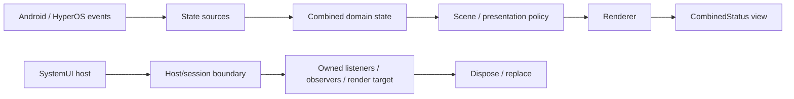
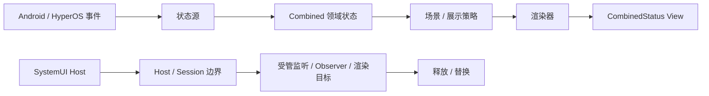

# CombinedStatus

[English](#english) | [简体中文](#简体中文)

---

## English

**CombinedStatus** is an LSPosed module for Xiaomi HyperOS that combines battery, mobile-network, and Wi-Fi status into a single status-bar indicator.

The project is being rebuilt around explicit SystemUI lifecycle ownership, event-driven state, conservative native-geometry integration, and bounded diagnostics so that new features remain maintainable instead of accumulating scene-specific patches.

> **Status:** pre-release development. The planned initial display version is **0.0.1** and has not yet been formally released.

### Current scope

CombinedStatus currently targets:

- Xiaomi HyperOS;
- `com.android.systemui`;
- Modern Xposed API 102;
- Android 13 / API 33 and later;
- MIUIX 0.9.4 for the companion application.

Current verified compatibility baseline:

- HyperOS SystemUI `17.03.260226.r`.

Compatibility is validated against the exact target SystemUI rather than inferred from version names alone. Other HyperOS builds or device variants may differ internally and are not assumed compatible without evidence.

### Current capabilities

#### SystemUI runtime

- Combined battery, mobile-network, and Wi-Fi presentation for the Home status bar.
- Event-driven state acquisition for battery, Wi-Fi, mobile network, airplane mode, default-data subscription, connectivity, and native tint.
- Verified SystemUI host capture and runtime compatibility checks.
- Modern Xposed hot reload with generation replacement rather than duplicate hook stacking.
- Shared scene and layout-policy models for future Home, notification-shade, Control Center, keyguard, and AOD integration.
- Conservative SystemUI integration: native layout, translation, visibility, and animation ownership are preserved wherever practical.

#### Diagnostics

- General and Detailed diagnostics levels independent from build type.
- Bounded lifecycle, compatibility, state, rendering, topology, and geometry diagnostics.
- Built-in feedback report export/share using LSPosed module logs with logcat fallback.
- Explicit, user-confirmed SystemUI restart through bounded Root execution.
- No resident logging service, polling loop, or continuous View-tree sampling.

#### Companion app

- MIUIX 0.9.4 interface with Home, Features, and Settings.
- Predictive back and direction-aware swipe-back navigation.
- Light/dark mode and dynamic-color preferences.
- Standard or floating bottom navigation with optional Blur/Glass material.
- English and Simplified Chinese.
- Android 13+ per-app language selection.
- Optional launcher-icon hiding while retaining a non-launcher app entry point.

### Architecture

CombinedStatus separates the **state/rendering flow** from **lifecycle ownership** so a visual change does not implicitly become a SystemUI lifecycle or geometry owner.

The upper path represents the current state-to-render flow. The lower path represents the ownership model being progressively enforced during the ongoing runtime migration: host-specific resources should be created, replaced, and disposed within an explicit host/session boundary.

### Design principles

CombinedStatus follows three project-wide principles:

- **Standardized** — respect Android, HyperOS, MIUIX, and Modern Xposed lifecycle and ownership conventions.
- **Lightweight** — avoid unnecessary polling, duplicate state, hooks, listeners, background work, Root processes, and high-frequency diagnostics.
- **Modern** — prefer maintained platform/library APIs when they fit lifecycle and compatibility requirements.

SystemUI integration also follows these architectural constraints:

- host-scoped runtime state should remain host-scoped;
- long-lived resources require an explicit owner and cleanup path;
- one live SystemUI property should have one runtime writer;
- native layout geometry, CombinedStatus visual geometry, transition geometry, and optical adjustment are separate responsibilities;
- observing SystemUI behavior does not automatically grant CombinedStatus ownership of that behavior;
- when a safe replacement cannot be established, the module should degrade toward native HyperOS behavior rather than leave a broken partial replacement.

The complete engineering rules for developers and contributors are in [CONTRIBUTING.md](CONTRIBUTING.md).

### Build channels

| Channel | Purpose |
| --- | --- |
| **Debug** | Development probes, assertions, detailed topology/ownership diagnostics, and experimental validation. |
| **Canary** | Daily real-device testing close to Release behavior; non-debuggable and release-optimized while retaining bounded runtime diagnostics. |
| **Release** | Formal distributable build with production diagnostics only. |

Core feature behavior is shared across build channels. Build type controls diagnostic capability, not whether the core CombinedStatus renderer exists.

### Development workflow

- `main` is the stable, installable, validated integration baseline.
- `dev` is the active integration branch.
- `feat/*` is reserved for larger isolated experiments that return to `dev` after validation.

Runtime-sensitive changes require both CI and focused real-device validation. CI success alone is not treated as proof that SystemUI behavior is correct.

Detailed contribution, lifecycle, ownership, migration, changelog, and validation rules are defined in [CONTRIBUTING.md](CONTRIBUTING.md).

### Build requirements

| Item | Value |
| --- | --- |
| Package | `com.chaners.combinedstatus` |
| Planned initial display version | `0.0.1` (unreleased) |
| minSdk | 33 |
| compileSdk / targetSdk | 37 |
| JVM | 21 |
| Modern Xposed API | 102 |
| MIUIX | 0.9.4 |
| Kotlin | 2.4.20 |
| Android Gradle Plugin | 9.4.1 |

Build with Android Studio using the Android 17 / API 37 SDK and JDK 21, or use the repository's GitHub Actions workflows.

Test artifacts use a dedicated CI test certificate so compatible builds can update in place. Formal Release signing is isolated from CI test signing, and signing credentials are not stored in the repository.

### Versioning and changelog

The external display version changes only when a formal version is intentionally advanced. Ordinary development iterations use internal build identifiers.

Until the first formal release, [CHANGELOG.md](CHANGELOG.md) keeps a single `[Unreleased]` section describing the **net state intended for 0.0.1**, not the full sequence of experiments used to reach it.

### Terminology

Project-facing text consistently uses:

- English: **mobile network**
- Chinese: **移动网络**
- Internal domain names: `mobileNetwork` / `mobileSignal`

Exact upstream Android/HyperOS API, class, field, method, and resource identifiers keep their original names.

---

## 简体中文

**CombinedStatus** 是一个面向 Xiaomi HyperOS 的 LSPosed 模块，用于将电池、移动网络和 Wi-Fi 状态整合为一个状态栏图标。

项目当前正在进行从头重构，核心方向是明确 SystemUI 生命周期与所有权、采用事件驱动状态链、尽量保留原生几何控制权，并使用有边界的诊断机制，避免功能增长再次演变为大量场景补丁。

> **当前状态：** 尚处于预发布开发阶段。计划中的首个外显版本为 **0.0.1**，目前尚未正式发布。

### 当前适配范围

CombinedStatus 当前面向：

- Xiaomi HyperOS；
- `com.android.systemui`；
- Modern Xposed API 102；
- Android 13 / API 33 及以上；
- 配套应用使用 MIUIX 0.9.4。

当前已验证兼容性基线：

- HyperOS SystemUI `17.03.260226.r`。

兼容性以目标 SystemUI 的真实结构和运行时行为为依据，而不是仅根据版本号推断。其他 HyperOS 版本或不同机型内部实现可能存在差异，在没有证据前不会默认视为兼容。

### 当前能力

#### SystemUI 运行时

- 在主状态栏中提供电池、移动网络和 Wi-Fi 的三合一显示。
- 通过事件驱动方式获取电池、Wi-Fi、移动网络、飞行模式、默认数据卡、连接状态和原生 SystemUI Tint。
- 已验证的 SystemUI Host 捕获与运行时兼容性检查。
- Modern Xposed 热重载采用代际替换，避免重复堆叠 Hook。
- 为后续主状态栏、通知栏过渡、控制中心、锁屏和 AOD 共用场景与布局策略模型。
- 对 SystemUI 保持保守接入原则：在可行情况下保留原生布局、位移、可见性和动画的所有权。

#### 诊断

- General / Detailed 两档诊断等级与构建类型相互独立。
- 有边界的生命周期、兼容性、状态、渲染、拓扑和几何诊断。
- 内置反馈报告导出/分享，优先读取 LSPosed 模块日志，并以 logcat 作为回退。
- 可由用户明确确认后执行 SystemUI 重启，Root 操作保持有边界。
- 不使用常驻日志服务、轮询循环或持续 View 树扫描。

#### 配套应用

- 基于 MIUIX 0.9.4 的 Home、Features、Settings 界面。
- 支持预测返回与方向感知的页面滑动返回。
- 支持亮色/深色模式和动态取色。
- 支持标准/悬浮底部导航，以及可选 Blur / Glass 材质。
- 支持英文和简体中文。
- Android 13+ 支持应用内语言选择。
- 可隐藏桌面图标，同时保留非桌面入口。

### 架构

CombinedStatus 将**状态/渲染链**与**生命周期所有权**分开处理，避免一个视觉修改顺带接管 SystemUI 的生命周期或原生几何。

上方表示当前的状态到渲染链；下方表示正在渐进落实的 ownership 迁移方向：Host 相关资源应在明确的 Host / Session 边界内创建、替换和释放，而不是重新堆回全局模块状态。

### 设计原则

CombinedStatus 遵循三项项目级原则：

- **规范化**：遵循 Android、HyperOS、MIUIX 和 Modern Xposed 的生命周期、所有权与平台规范。
- **轻量化**：避免不必要的轮询、重复状态、重复 Hook/监听、后台工作、常驻 Root 进程和高频诊断。
- **现代化**：在生命周期和兼容性条件允许时，优先采用当前维护中的平台与库 API。

SystemUI 接入还遵循以下架构约束：

- Host 相关状态应保持 Host 作用域，不应无边界全局化；
- 长生命周期资源必须有明确 owner 和清理路径；
- 同一个实时 SystemUI 属性原则上只应有一个 writer；
- 原生布局几何、CombinedStatus 视觉几何、过渡几何和光学校正必须相互区分；
- 能观察 SystemUI 行为，不等于获得修改该行为的所有权；
- 当无法安全建立替换关系时，应优先退回 HyperOS 原生行为，而不是留下半工作状态。

完整的开发者与贡献者工程规范见 [CONTRIBUTING.md](CONTRIBUTING.md)。

### 构建通道

| 通道 | 用途 |
| --- | --- |
| **Debug** | 开发探针、断言、详细拓扑/所有权诊断和实验验证。 |
| **Canary** | 日常实机测试；尽量接近 Release，默认不可调试并进行 Release 优化，同时保留有边界的运行时诊断。 |
| **Release** | 正式发布构建，仅保留生产级诊断。 |

三种构建共享核心功能逻辑。构建类型只决定诊断能力，不决定核心 CombinedStatus 渲染是否存在。

### 开发流程

- `main`：稳定、可安装、已验证的集成基线。
- `dev`：当前主要开发与集成分支。
- `feat/*`：较大的隔离实验，验证后再合回 `dev`。

涉及 SystemUI 运行时行为的修改必须同时经过 CI 和针对性的实机验证。CI 通过本身不能证明 SystemUI 运行时行为正确。

详细的贡献流程、生命周期、所有权、迁移、Changelog 和验证规则见 [CONTRIBUTING.md](CONTRIBUTING.md)。

### 构建要求

| 项目 | 当前值 |
| --- | --- |
| 包名 | `com.chaners.combinedstatus` |
| 计划首个外显版本 | `0.0.1`（尚未发布） |
| minSdk | 33 |
| compileSdk / targetSdk | 37 |
| JVM | 21 |
| Modern Xposed API | 102 |
| MIUIX | 0.9.4 |
| Kotlin | 2.4.20 |
| Android Gradle Plugin | 9.4.1 |

可使用安装了 Android 17 / API 37 SDK 与 JDK 21 的 Android Studio 构建，也可以使用仓库中的 GitHub Actions 工作流。

测试构建使用独立的 CI 测试证书，以便兼容构建可以直接覆盖安装。正式 Release 签名与 CI 测试签名相互隔离，签名凭据不会存入仓库。

### 版本与变更日志

外显版本号只在明确推进正式版本时更新；普通开发迭代使用内部构建标识。

在首个正式版本发布前，[CHANGELOG.md](CHANGELOG.md) 始终只保留一个 `[Unreleased]` 区域，用于描述**准备进入 0.0.1 的当前净状态**，而不是记录达到该状态经历过的全部实验过程。

### 术语

项目对外统一使用：

- 英文：**mobile network**
- 中文：**移动网络**
- 内部领域命名：`mobileNetwork` / `mobileSignal`

Android / HyperOS 上游 API、类、字段、方法和资源标识符保持原名。
